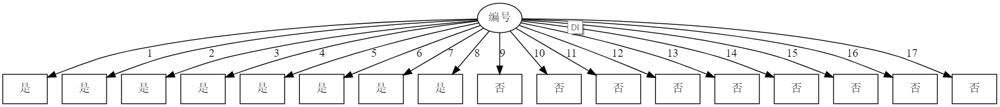
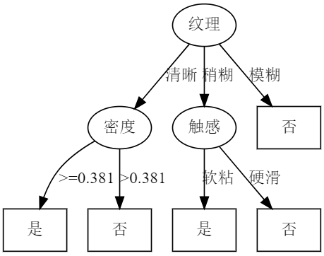
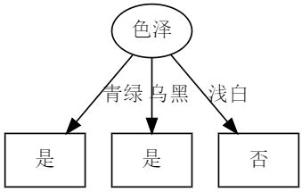
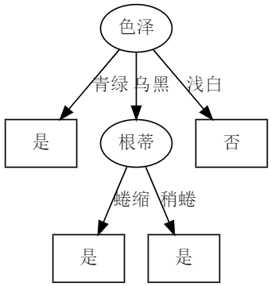
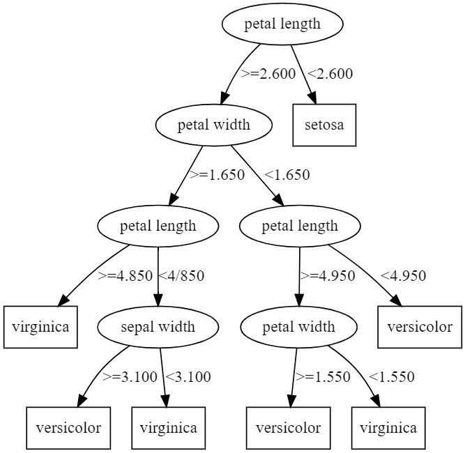
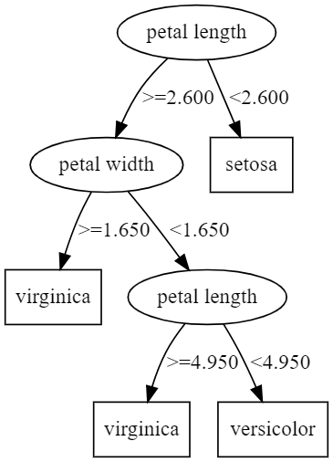
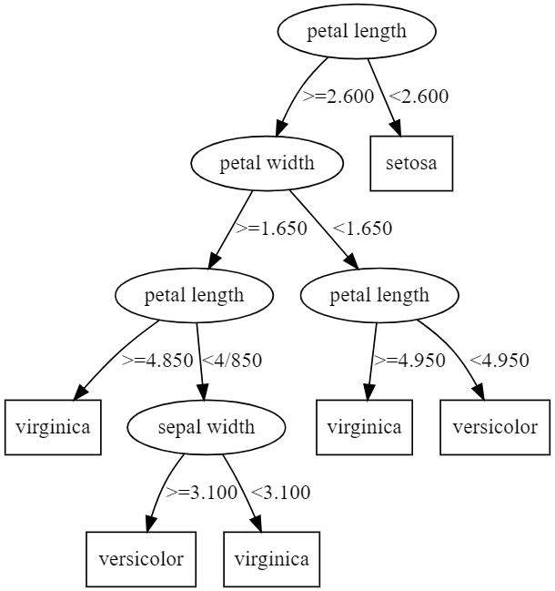
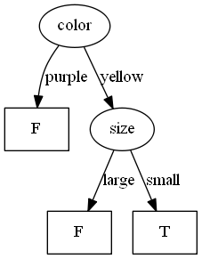
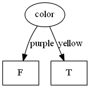

# 决策树实验报告

* 班级：2017211316
* 学号：2017210593
* 姓名：张博涵

## 实验要求

1. 编程实现一个基于信息熵进行划分选择的决策树算法，并为表中的数据生成一棵决策树。

    | 编号 | 色泽 | 根蒂 | 敲声 | 纹理 | 脐部 | 触感 | 密度  | 含糖率 | 好瓜 |
    | ---- | ---- | ---- | ---- | ---- | ---- | ---- | ----- | ------ | ---- |
    | 1    | 青绿 | 蜷缩 | 浊响 | 清晰 | 凹陷 | 硬滑 | 0.697 | 0.460  | 是   |
    | 2    | 乌黑 | 蜷缩 | 沉闷 | 清晰 | 凹陷 | 硬滑 | 0.774 | 0.376  | 是   |
    | 3    | 乌黑 | 蜷缩 | 浊响 | 清晰 | 凹陷 | 硬滑 | 0.634 | 0.264  | 是   |
    | 4    | 青绿 | 蜷缩 | 沉闷 | 清晰 | 凹陷 | 硬滑 | 0.608 | 0.318  | 是   |
    | 5    | 浅白 | 蜷缩 | 浊响 | 清晰 | 凹陷 | 硬滑 | 0.556 | 0.215  | 是   |
    | 6    | 青绿 | 稍蜷 | 浊响 | 清晰 | 稍凹 | 软粘 | 0.403 | 0.237  | 是   |
    | 7    | 乌黑 | 稍蜷 | 浊响 | 稍糊 | 稍凹 | 软粘 | 0.481 | 0.149  | 是   |
    | 8    | 乌黑 | 稍蜷 | 浊响 | 清晰 | 稍凹 | 硬滑 | 0.437 | 0.211  | 是   |
    | 9    | 乌黑 | 稍蜷 | 沉闷 | 稍糊 | 稍凹 | 硬滑 | 0.666 | 0.091  | 否   |
    | 10   | 青绿 | 硬挺 | 清脆 | 清晰 | 平坦 | 软粘 | 0.243 | 0.267  | 否   |
    | 11   | 浅白 | 硬挺 | 清脆 | 模糊 | 平坦 | 硬滑 | 0.245 | 0.057  | 否   |
    | 12   | 浅白 | 蜷缩 | 浊响 | 模糊 | 平坦 | 软粘 | 0.343 | 0.099  | 否   |
    | 13   | 青绿 | 稍蜷 | 浊响 | 稍糊 | 凹陷 | 硬滑 | 0.639 | 0.161  | 否   |
    | 14   | 浅白 | 稍蜷 | 沉闷 | 稍糊 | 凹陷 | 硬滑 | 0.657 | 0.198  | 否   |
    | 15   | 乌黑 | 稍蜷 | 浊响 | 清晰 | 稍凹 | 软粘 | 0.360 | 0.370  | 否   |
    | 16   | 浅白 | 蜷缩 | 浊响 | 模糊 | 平坦 | 硬滑 | 0.593 | 0.042  | 否   |
    | 17   | 青绿 | 蜷缩 | 沉闷 | 稍糊 | 稍凹 | 硬滑 | 0.719 | 0.103  | 否   |

2. 编程实现基于基尼指数进行划分选择的决策树算法，为表中数据生成预剪枝，后剪枝决策树，并与未剪枝的决策树进行比较。

    | 编号 | 色泽 | 根蒂 | 敲声 | 纹理 | 脐部 | 触感 | 好瓜 |
    | ---- | ---- | ---- | ---- | ---- | ---- | ---- | ---- |
    | 1    | 青绿 | 蜷缩 | 浊响 | 清晰 | 凹陷 | 硬滑 | 是   |
    | 2    | 乌黑 | 蜷缩 | 沉闷 | 清晰 | 凹陷 | 硬滑 | 是   |
    | 3    | 乌黑 | 蜷缩 | 浊响 | 清晰 | 凹陷 | 硬滑 | 是   |
    | 4    | 青绿 | 蜷缩 | 沉闷 | 清晰 | 凹陷 | 硬滑 | 是   |
    | 5    | 浅白 | 蜷缩 | 浊响 | 清晰 | 凹陷 | 硬滑 | 是   |
    | 6    | 青绿 | 稍蜷 | 浊响 | 清晰 | 稍凹 | 软粘 | 是   |
    | 7    | 乌黑 | 稍蜷 | 浊响 | 稍糊 | 稍凹 | 软粘 | 是   |
    | 8    | 乌黑 | 稍蜷 | 浊响 | 清晰 | 稍凹 | 硬滑 | 是   |
    | 9    | 乌黑 | 稍蜷 | 沉闷 | 稍糊 | 稍凹 | 硬滑 | 否   |
    | 10   | 青绿 | 硬挺 | 清脆 | 清晰 | 平坦 | 软粘 | 否   |
    | 11   | 浅白 | 硬挺 | 清脆 | 模糊 | 平坦 | 硬滑 | 否   |
    | 12   | 浅白 | 蜷缩 | 浊响 | 模糊 | 平坦 | 软粘 | 否   |
    | 13   | 青绿 | 稍蜷 | 浊响 | 稍糊 | 凹陷 | 硬滑 | 否   |
    | 14   | 浅白 | 稍蜷 | 沉闷 | 稍糊 | 凹陷 | 硬滑 | 否   |
    | 15   | 乌黑 | 稍蜷 | 浊响 | 清晰 | 稍凹 | 软粘 | 否   |
    | 16   | 浅白 | 蜷缩 | 浊响 | 模糊 | 平坦 | 硬滑 | 否   |
    | 17   | 青绿 | 蜷缩 | 沉闷 | 稍糊 | 稍凹 | 硬滑 | 否   |

3. 选择两个UCI数据集，对上述3种算法产生的未剪枝，预剪枝，后剪枝的决策树进行实验比较

## 原理

### 决策树

* 定义：一种描述对实例进行分类的树形结构。决策树由点和有向边组成。节点有两种类型：内部节点和叶节点。内部节点表示一种特征或者属性，叶节点表示一个分类。构建决策树时通常采用自上而下的方法，在每一步选择一个最好的属性来分裂。[8] "最好" 的定义是使得子节点中的训练集尽量的纯。不同的算法使用不同的指标来定义"最好"。
* 意义：每次都找不同的切分点，将样本空间逐渐进行细分，最后把属于同一类的空间进行合并，就形成了决策边界，树的层次越深，决策边界的切分就越细，区分越准确，同时也越有可能产生过拟合。
  * 决策树是一个预测模型；他代表的是对象属性与对象值之间的一种映射关系。树中每个节点表示某个对象，而每个分叉路径则代表的某个可能的属性值，而每个叶结点则对应从根节点到该叶节点所经历的路径所表示的对象的值。决策树仅有单一输出，若欲有复数输出，可以建立独立的决策树以处理不同输出。
  * 分支使用的是节点属性中的离散型数据，如果数据是连续型的，也需要转化成离散型数据才能在决策树中展示。
  * 决策树的路径具有一个重要的性质：互斥且完备,即每一个样本均被且只能被一条路径所覆盖。决策树学习算法主要由三部分构成：
    * 特征选择
    * 决策树生成
    * 决策树的剪枝
* 决策树的建立
  开始，构建根节点，将所有训练数据放在根节点，选择一个最优特征，按照这一特征的取值将训练数据分割为子集，使各个子集有一个当前条件下最好的分类。如果这些子集能被基本正确分类，那么构造叶节点，将对应子集集中到叶节点。如果有子集不能被正确分类，那么就这些子集选择新的最优特征，继续对其进行分割，构建相应的节点。递归进行上述的操作，直到所有训练数据子集均能被正确分类。
  * 节点分裂：一般当一个节点所代表的属性无法给出判断时，则选择将这一节点分成2个子节点（如不是二叉树的情况会分成n个子节点）
  * 阈值的确定，选择适当的阈值使得分类错误率最小。
* 与其他的数据挖掘算法相比，决策树有许多优点:
  * 易于理解和解释，人们很容易理解决策树的意义。
  * 只需很少的数据准备，其他技术往往需要数据归一化。
  * 既可以处理数值型数据也可以处理类别型数据。其他技术往往只能处理一种数据类型。例如关联规则只能处理类别型的而神经网络只能处理数值型的数据。
  * 使用白箱模型，输出结果容易通过模型的结构来解释。而神经网络是黑箱模型，很难解释输出的结果。
  * 可以通过测试集来验证模型的性能，可以考虑模型的稳定性。
  * 强健控制，对噪声处理有好的强健性。
  * 可以很好的处理大规模数据 。

### ID3

* 信息熵 entropy
    熵是接收的每条消息中包含的信息的平均量，熵是对不确定性的测量。但是在信息世界，熵越高，则能传输越多的信息，熵越低，则意味着传输的信息越少。
    当取自有限的样本时，熵的公式可以表示为：
    $$H(X) = -\sum^{n}_{i = 1}p_i \log_2 p_i$$
    其中若 $p_i = 0$ 则定义 $p_i\log p_i = 0$

    ```python
    def calc_ent(datasets):
        data_length = len(datasets)
        label_count = {}
        for i in range(data_length):
            label = datasets[i][-1]
            if label not in label_count:
                label_count[label] = 0
            label_count[label] += 1
        ent = -sum([(p / data_length) * log(p / data_length, 2)
                    for p in label_count.values()])
        return ent
    ```

  * 信息量
    信息量是对信息的度量，就跟时间的度量是秒一样，当我们考虑一个离散的随机变量x的时候，当我们观察到的这个变量的一个具体值的时候，我们接收到了多少信息呢？多少信息用信息量来衡量，我们接受到的信息量跟具体发生的事件有关。信息的大小跟随机事件的概率有关。越小概率的事情发生了产生的信息量越大，越大概率的事情发生了产生的信息量越小
* 信息增益 information gain
    得知特征 $X$ 的信息而使得类 $Y$ 的信息的不确定性减少的程度。
    特征 $A$ 对训练数据集 $D$ 的信息增益 $g(D, A)$ 定义为集合 $D$ 的经验熵 $H(D)$ 与特征 $A$ 给定条件下 $D$ 的经验条件熵 $H(D|A)$ 的差。
    $$g(D,A) = H(D) - H(D|A)$$
    一般地，熵 $H(Y)$ 与条件熵 $H(Y|X)$ 之差称为互信息(mutual information) 根据信息增益准则进行特征选择的方法是：对训练数据集D，计算其每个特征的信息增益，并比它们的大小，从而选择信息增益最大的特征。
    假设训练数据集为 $D$，样本容量为 $|D|$,有 $K$ 个类别 $C_k$，$|C_k|$ 为类别 $C_k$ 的样本个数。某一特征 $A$ 有 $n$ 个不同的取值 $a_1, a_2, ..., a_n$。根据特征 $A$ 的取值可将数据集 $D$ 划分为 $n$ 个子集 $D_1, D_2, ..., D_n$， $|D_i$|为 $D_i$ 的样本个数。并记子集 $D_i$ 中属于类 $C_k$ 的样本的集合为 $D_{ik}$，$|D_{ik}|$ 为 $D_{ik}$ 的样本个数。

    ```python
    def cond_ent(datasets, axis=0):
        data_length = len(datasets)
        feature_sets = {}
        for i in range(data_length):
            feature = datasets[i][axis]
            if feature not in feature_sets:
                feature_sets[feature] = []
            feature_sets[feature].append(datasets[i])
        cond_ent = sum(
            [(len(p) / data_length) * calc_ent(p) for p in feature_sets.values()])
        return cond_ent

    def info_gain(ent, cond_ent):
        return ent - cond_ent
    ```

ID3算法的核心是在决策树的各个结点上应用信息增益准则进行特征选择。具体做法是：

* 从根节点开始，对结点计算所有可能特征的信息增益，选择信息增益最大的特征作为结点的特征，并由该特征的不同取值构建子节点；
* 对子节点递归地调用以上方法，构建决策树；
* 直到所有特征的信息增益均很小或者没有特征可选时为止。

```text
判断数据集中的每个子项是否属于同一类：
    if true:
        return 类标签；
    else:
        寻找划分数据集的最佳特征
        根据最佳特征划分数据集
        创建分支节点
        for 每个划分的子集
            递归调用createBranch();
        return 分支节点
```

### C4.5

* 信息增益比 information gain ratio
    以信息增益作为划分训练数据集的特征，存在偏向与选择取值较多的特征的问题。使用信息增益比可以对这个问题进行矫正。
    特征 $A$ 对训练数据集 $D$ 的信息增益比 $g_R(D,A)$ 定义为其信息增益 $g(D,A)$ 和训练数据集 $D$ 关于特征 $A$ 的熵 $H_A(D)$ 的比值。
    $$g_R(D,A) = \frac{g(D,A)}{H_A(D,A)}$$
    其中 $H_A(D) = \sum_{i=1}^n \frac{|D_i|}{|D|} \log_2 \frac{|D_i|}{|D|}$, $n$ 是特征 $A$ 取值的个数。

相比 ID3 算法，C4.5 算法更换了特征选择的标准，使用信息增益比进行特征选择。不直接选择增益率最大的候选划分属性，候选划分属性中找出信息增益高于平均水平的属性（这样保证了大部分好的的特征），再从中选择增益率最高的（又保证了不会出现编号特征这种极端的情况）
对于连续值属性来说，可取值数目不再有限，因此可以采用离散化技术（如二分法）进行处理。将属性值从小到大排序，然后选择中间值作为分割点，数值比它小的点被划分到左子树，数值不小于它的点被分到又子树，计算分割的信息增益率，选择信息增益率最大的属性值进行分割。

```text
Function C4.5(R:包含连续属性的无类别属性集合,C:类别属性,S:训练集)  
/*返回一棵决策树*/  
Begin  
   If S 为空,返回一个值为 Failure 的单个节点;  
   If S 是由相同类别属性值的记录组成：  
      返回一个带有该值的单个节点;  
   If R 为空,则返回一个单节点,其值为在 S 的记录中找出的频率最高的类别属性值;  
   [注意未出现错误则意味着是不适合分类的记录]；  
  For 所有的属性 R(Ri) Do  
        If 属性 Ri 为连续属性，则  
     Begin  
           将Ri的最小值赋给 A1：  
        将Rm的最大值赋给Am；/*m值手工设置*/  
           For j From 2 To m-1 Do Aj=A1+j*(A1Am)/m;  
           将 Ri 点的基于{< =Aj,>Aj}的最大信息增益属性 (Ri,S) 赋给 A；  
     End；  
  将 R 中属性之间具有最大信息增益的属性 (D,S) 赋给 D;  
   将属性D的值赋给{dj/j=1,2...m}；  
  将分别由对应于 D 的值为 dj 的记录组成的S的子集赋给 {sj/j=1,2...m};  
   返回一棵树，其根标记为 D;树枝标记为 d1,d2...dm;  
   再分别构造以下树:  
   C4.5(R-{D},C,S1),C4.5(R-{D},C,S2)...C4.5(R-{D},C,Sm);  

End C4.5
```

### CART

CART与ID3区别： CART中用于选择变量的不纯性度量是Gini指数； 如果目标变量是标称的，并且是具有两个以上的类别，则CART可能考虑将目标类别合并成两个超类别（双化）； 如果目标变量是连续的，则CART算法找出一组基于树的回归方程来预测目标变量。

* Gini 指数
    分类问题中假设有 $K$ 个类，样本点属于第 $k$ 个类的概率为 $p_k$，则概率分布的基尼指数为定义为
    $$Gini(p) = \sum_{k=1}^K p_k(1 - p_k) = 1 - \sum_{k = 1}^K p_k^2$$
    对于二分类问题和给定的样本集合 $D$ 其基尼指数为
    $$Gini(D) = 1 - \sum_{k=1}^K (\frac{|C_k|}{|D|})^2$$
    若样本集合 $D$ 根据特征 $A$ 是否取某一可能的值 $a$ 分割为 $D_1, D_2$ 两部分，则在特征 $A$ 的条件下集合 $D$ 的基尼指数定义为
    $$Gini(D,A) = \frac{|D_1|}{|D|} Gini(D_1) + \frac{|D_2|}{|D|} Gini(D_2)$$
    $Gini(D)$ 反映了数据集 $D$ 的纯度，值越小，纯度越高。我们在候选集合中选择使得划分后基尼指数最小的属性作为最优化分属性。

    ```python
    def gini(data_set):
        """
        计算gini的值，即Gini(p)
        """
        length = len(data_set)
        category_2_cnt = calculate_diff_count(data_set)
        sum = 0.0
        for category in category_2_cnt:
            sum += pow(float(category_2_cnt[category]) / length, 2)
        return 1 - sum
    ```

CART是一棵二叉树，采用二元切分法，每次把数据切成两份，分别进入左子树、右子树。而且每个非叶子节点都有两个孩子，所以CART的叶子节点比非叶子多1。相比ID3和C4.5，CART应用要多一些，既可以用于分类也可以用于回归。CART分类时，使用基尼指数（Gini）来选择最好的数据分割的特征，gini描述的是纯度，与信息熵的含义相似。CART中每一次迭代都会降低GINI系数。

* 算法流程：

  1. CART回归树预测回归连续型数据，假设X与Y分别是输入和输出变量，并且Y是连续变量。在训练数据集所在的输入空间中，递归的将每个区域划分为两个子区域并决定每个子区域上的输出值，构建二叉决策树。
  2. 选择最优切分变量j与切分点 $s$：遍历变量 $j$，对规定的切分变量 $j$ 扫描切分点 $s$，选择使下式得到最小值时的 $(j,s)$ 对。其中 $R_m$ 是被划分的输入空间，$c_m$ 是空间 $R_m$ 对应的固定输出值。
  3. 用选定的 $(j,s)$ 对，划分区域并决定相应的输出值。
  4. 继续对两个子区域调用上述步骤，将输入空间划分为 $M$ 个区域 $R_1,R_2,…,R_m$，生成决策树。

    当输入空间划分确定时，可以用平方误差来表示回归树对于训练数据的预测方法，用平方误差最小的准则求解每个单元上的最优输出值。
    $$\sum_{x_i \in R_m} (y_i - f(x_i))^2$$

### 剪枝

为了避免决策树“过拟合”样本。前面的算法生成的决策树非常的详细而庞大，每个属性都被详细地加以考虑，决策树的树叶节点所覆盖的训练样本都是“纯”的。因此用这个决策树来对训练样本进行分类的话，你会发现对于训练样本而言，这个树表现堪称完美，它可以100%完美正确得对训练样本集中的样本进行分类（因为决策树本身就是100%完美拟合训练样本的产物）。但是，这会带来一个问题，如果训练样本中包含了一些错误，按照前面的算法，这些错误也会100%一点不留得被决策树学习了，这就是“过拟合”。

#### 预剪枝 pre-pruning

预剪枝就是在树的构建过程（只用到训练集），设置一个阈值（样本个数小于预定阈值或GINI指数小于预定阈值），使得当在当前分裂节点中分裂前和分裂后的误差超过这个阈值则分列，否则不进行分裂操作。所有决策树的构建方法，都是在无法进一步降低熵的情况下才会停止创建分支的过程，为了避免过拟合，可以设定一个阈值，熵减小的数量小于这个阈值，即使还可以继续降低熵，也停止继续创建分支。但是这种方法实际中的效果并不好。
在划分之前，所有样本集中于根节点，若不进行划分，该节点被标记为叶节点，其类别标记为训练样例最多的类别。若进行划分在测试集上的准确率小于在根节点不进行划分的准确率，或增幅没有超过阈值，都不进行划分，作为一个叶节点返回当前数据集中最多的标签类型。

* 预剪枝就是在完全正确分类训练集之前，较早地停止树的生长。 具体在什么时候停止决策树的生长有多种不同的方法:
    1. 一种最为简单的方法就是在决策树到达一定高度的情况下就停止树的生长。
    2. 到达此结点的实例具有相同的特征向量，而不必一定属于同一类， 也可停止生长。
    3. 到达此结点的实例个数小于某一个阈值也可停止树的生长。
    4. 还有一种更为普遍的做法是计算每次扩张对系统性能的增益，如果这个增益值小于某个阈值则不进行扩展。

* 优点：快速，可以在构建决策树时进行剪枝，显著降低了过拟合风险。由于预剪枝不必生成整棵决策树，且算法相对简单，效率很高，适合解决大规模问题。但是尽管这一方法看起来很直接， 但是怎样精确地估计何时停止树的增长是相当困难的。
* 缺点：预剪枝基于贪心思想，本质上禁止分支展开，给决策树带来了欠拟合的风险。因为视野效果问题 。 也就是说在相同的标准下，也许当前的扩展会造成过度拟合训练数据，但是更进一步的扩展能够满足要求，也有可能准确地拟合训练数据。这将使得算法过早地停止决策树的构造。

```python
if pre_pruning:
    ans = []
    for index in range(len(test_dataset)):  # build label for test dataset
        ans.append(test_dataset[index][-1])
    result_counter = Counter()
    for vec in dataset:
        result_counter[vec[-1]] += 1
    # what will it be if it is a leaf node
    leaf_output = result_counter.most_common(1)[0][0]
    root_acc = cal_acc(test_output=[leaf_output] * len(test_dataset),
                        label=ans)
    outputs = []
    ans = []
    for value in uniqueVals:  # expand the node
        cut_testset = splitdataset(test_dataset, bestFeat, value)
        cut_dataset = splitdataset(dataset, bestFeat, value)
        for vec in cut_testset:
            ans.append(vec[-1])
        result_counter = Counter()
        for vec in cut_dataset:
            result_counter[vec[-1]] += 1
        leaf_output = result_counter.most_common(1)[0][0]  # what will it be if it is a leaf node
        outputs += [leaf_output] * len(cut_testset)
    cut_acc = cal_acc(test_output=outputs, label=ans)

    if cut_acc <= root_acc + threshold: # whether expand the node or not
        return leaf_output
```

#### 后剪枝 post-pruning

决策树构造完成后进行剪枝。剪枝的过程是对拥有同样父节点的一组节点进行检查，判断如果将其合并，熵的增加量是否小于某一阈值。如果确实小，则这一组节点可以合并一个节点，其中包含了所有可能的结果。后剪枝是目前最普遍的做法。
后剪枝的剪枝过程是删除一些子树，然后用其叶子节点代替，这个叶子节点所标识的类别通过大多数原则 (majority class criterion) 确定。所谓大多数原则，是指剪枝过程中, 将一些子树删除而用叶节点代替,这个叶节点所标识的类别用这棵子树中大多数训练样本所属的类别来标识。相比于前剪枝，后剪枝方法更常用，是因为在前剪枝方法中精确地估计何时停止树增长很困难。

* 优点：欠拟合风险小，泛化性能好
* 缺点：在生成决策树之后完成，自底向上对所有非叶节点进行逐一考察，训练的时间开销较大

```python

def prune_tree(node, prunedList):
    # Base case: we've reached a leaf
    if isinstance(node, Leaf):
        return node
    # If we reach a pruned node, make that node a leaf node and return.
    # Since it becomes a leaf node, the nodes
    # below it are automatically not considered
    if int(node.id) in prunedList:
        return Leaf(node.rows, node.id, node.depth)

    # Call this function recursively on the true branch
    node.true_branch = prune_tree(node.true_branch, prunedList)

    # Call this function recursively on the false branch
    node.false_branch = prune_tree(node.false_branch, prunedList)

    return node
```

## 实现细节

测试数据使用李航老师的统计方法中对应的数据集。

### ID3 算法实现

```python
def ID3_chooseBestFeature(dataset):
    numFeatures = len(dataset[0]) - 1
    baseEnt = cal_entropy(dataset)
    bestInfoGain = 0.0
    bestFeature = -1
    for i in range(numFeatures):  # check all features
        featList = [example[i] for example in dataset]
        uniqueVals = set(featList)
        newEnt = 0.0
        # claculate entropy of every divide ways
        for value in uniqueVals:
            # choose the samples mmeeting the requirement
            subdataset = splitdataset(dataset, i, value)
            p = len(subdataset) / float(len(dataset))
            newEnt += p * cal_entropy(subdataset)
        infoGain = baseEnt - newEnt

        if (infoGain > bestInfoGain):
            bestInfoGain = infoGain  # choose the largest information gain
            bestFeature = i
    return bestFeature
```

### C4.5 算法实现

```python
def C45_chooseBestFeatureToSplit(dataset):
    numFeatures = len(dataset[0]) - 1
    baseEnt = cal_entropy(dataset)
    bestInfoGain_ratio = 0.0
    bestFeature = -1
    for i in range(numFeatures):  # check every feature
        featList = [example[i] for example in dataset]
        uniqueVals = set(featList)
        newEnt = 0.0
        IV = 0.0
        for value in uniqueVals:
            subdataset = splitdataset(dataset, i, value)
            p = len(subdataset) / float(len(dataset))
            newEnt += p * cal_entropy(subdataset)
            IV = IV - p * log(p, 2)
        infoGain = baseEnt - newEnt
        if (IV == 0):
            continue
        infoGain_ratio = infoGain / IV  # infoGain_ratio of current feature

        if (infoGain_ratio > bestInfoGain_ratio):  # choose the greatest gain ratio
            bestInfoGain_ratio = infoGain_ratio
            bestFeature = i  # choose the feature corsbounding to the gain ratio
    return bestFeature
```

### CART 算法实现

```python
def CART_chooseBestFeature(dataset):
    numFeatures = len(dataset[0]) - 1  # except the column of labels
    bestGini = 999999.0
    bestFeature = -1  # default label

    for i in range(numFeatures):
        featList = [example[i] for example in dataset]
        uniqueVals = set(featList)  # get the possible values of each feature
        gini = 0.0

        for value in uniqueVals:
            subdataset = splitdataset(dataset, i, value)
            p = len(subdataset) / float(len(dataset))
            subp = len(splitdataset(subdataset, -1, '0')) / float(len(subdataset))
        gini += p * (1.0 - pow(subp, 2) - pow(1 - subp, 2))

        if (gini < bestGini):
            bestGini = gini
            bestFeature = i

    return bestFeature
```

### 建树操作

因为建树过程相似，仅选取 ID3 算法的建树过程。

```python
def ID3_create_tree(dataset, labels, test_dataset):
    classList = [example[-1] for example in dataset]
    if classList.count(classList[0]) == len(classList):
        # 类别完全相同，停止划分
        return classList[0]
    if len(dataset[0]) == 1:
        # 遍历完所有特征时返回出现次数最多的
        return majority_count(classList)
    bestFeat = ID3_choose_best_feature(dataset)
    bestFeatLabel = labels[bestFeat]
    print(u"此时最优索引为：" + (bestFeatLabel))

    ID3Tree = {bestFeatLabel: {}}
    del (labels[bestFeat])
    # 得到列表包括节点所有的属性值
    featValues = [example[bestFeat] for example in dataset]
    uniqueVals = set(featValues)

    for value in uniqueVals:  # 枚举对用特征的每个取值
        subLabels = labels[:]
        ID3Tree[bestFeatLabel][value] = ID3_create_tree(
            split_dataset(dataset, bestFeat, value),
            subLabels,
            split_dataset(test_dataset, bestFeat, value))

        if cut_acc >= root_acc:
            return leaf_output

    return ID3Tree  # 如果没有剪枝返回节点
```

### 预剪枝

在实现时检查划分，如果在测试集上的准确率下降或没有上升到一个阈值时，将进行剪枝。

```python
    if pre_pruning:
        ans = []
        for index in range(len(test_dataset)):
            ans.append(test_dataset[index][-1])
        result_counter = Counter()
        for vec in dataset:
            result_counter[vec[-1]] += 1
        leaf_output = result_counter.most_common(1)[0][0]
        root_acc = cal_acc(test_output=[leaf_output] * len(test_dataset), label=ans)
        # 若当前节点是叶节点的准确率
        outputs = []
        ans = []
        for value in uniqueVals:
            cut_testset = split_dataset(test_dataset, bestFeat, value)
            cut_dataset = split_dataset(dataset, bestFeat, value)
            for vec in cut_testset:
                ans.append(vec[-1])
            result_counter = Counter()
            for vec in cut_dataset:
                result_counter[vec[-1]] += 1
            leaf_output = result_counter.most_common(1)[0][0]
            outputs += [leaf_output] * len(cut_testset)
        cut_acc = cal_acc(test_output=outputs, label=ans)  # 不进行剪枝在测试集上的准确率

        if cut_acc <= root_acc + threshold:  # 检查准确率上升情况
            return leaf_output
```

### 后剪枝

因为后剪枝的方法是自下而上的判断是否应该进行剪枝，所以在实现时在返回节点对象之前进行剪枝，决定是返回对象还是返回单一类别。

```python
    if post_pruning:
        tree_output = test_tree(C45Tree,
                                featLabels=total_labels,
                                testDataSet=test_dataset)
        ans = []
        for vec in test_dataset:
            ans.append(vec[-1])
        root_acc = cal_acc(tree_output, ans)
        result_counter = Counter()
        for vec in dataset:
            result_counter[vec[-1]] += 1
        leaf_output = result_counter.most_common(1)[0][0]
        cut_acc = cal_acc([leaf_output] * len(test_dataset), ans)

        if cut_acc >= root_acc:
            return leaf_output
```

表面上后剪枝的操作比预剪枝少，实际上在测试时递归的测试了当前节点所在子树的正确率。所以后剪枝带来的开销远大于的预剪枝。

## 实验结果分析

### 西瓜数据集3.0

实现基于信息熵进行划分的决策树算法（ID3）算法，并可视化结果如下：



可以注意到直接使用了编号信息进行划分，这一点和书中描述的 “基于信息增益的算法对可取数值较多的属性有偏好” 一致。下来除去编号属性并对结果进行可视化，结果如下：



### 西瓜数据集2.0

实现基于基尼指数进行划分选择的决策树算法，并进行相应的剪枝操作，使用书中的测试集，验证集划分。

* 未剪枝
    
* 预剪枝
    
* 后剪枝
    

### UCI 数据集

使用 UCI 数据集来判断未剪枝，预剪枝，后剪枝的方法产生的差异。

#### Iris

总数据集一共 150 条数据，共三个类别。在数据集中随机抽取30条数据组成测试集，再从中随机抽取30个作为训练时的验证集，余下的90条数据组成训练集。数据集的描述内容包括：花萼长度，花萼宽度，花瓣长度，花瓣宽度。

* 使用 CART 进行实验
  * 未剪枝
        
  * 预剪枝
        
  * 后剪枝
         不是剪枝一定要剪掉某个节点，如果树中本身的节点符合要求，可以不用剪枝。
        

经过观察，通过修改随机数种子来更改测试集和验证集的划分可以很大程度上影响决策树的准确率。

将数据集划分函数的 `random state` 从 15 改成 1 之后，后剪枝产生的决策树变为下图：

所以数据集的划分可以显著影响树的形状和结果的准确率。

#### Balloons

* 数据集描述
    数据集较小，共20个样本，四个属性。[数据集链接](https://archive.ics.uci.edu/ml/datasets/Balloons)
    |列名|取值|
    |--|--|
    |color|yellow, purple|
    |size|large, small|
    |act|stretch, dip|
    |age|adult, child|
    |label|T, F|

    其中选择4个样本作为测试集，4个样本作为训练时使用的验证集，余下的作为训练集。

* 不剪枝
    
* 预剪枝
    
* 后剪枝
    

## 个人感悟

通过本次实验有如下的发现和收获：

* 训练数据集大小和模型精度的关系：
  * 当训练数据集过小时，建立的模型精度过低，不具有参考价值。
  * 随训练数据集尺寸增大，建立模型的分类精度也会随之增大。
  * 当训练数据集尺寸增大到一定程度时，建立模型的精度不会再持续增大，且最大分类精度不会超过模型对训练数据的拟合度。
* 测试数据集大小与模型精度的关系：
  * 当测试数据集过小时，所测模型精度不具有代表性，没有参考价值。
  * 随测试数据集尺寸增大，模型精度也会随之增大。
  * 当测试数据集尺寸增大到一定程度时，对模型精度的测量值不会再持续增大，并保持在某一数值上下微小浮动。
* 属性个数对数据集大小与模型精度的关系的影响：
  * 当实例的属性个数过少时，所建模型精度低，没有参考价值。
  * 随实例的属性个数增多，所建立模型的精度也会随之增大。

通过本次实验透彻的了解了决策树各种构造算法和剪枝算法，通过使用 Python 进行实现基本的决策树和简单的剪枝算法，锻炼了我的代码能力和对相应伪代码的理解能力。

在一开始，我对于决策树的整体没有认识，不知道如何从零开始构建一棵决策树，通过仔细研究课本，将思路从认识整体调整为模拟数据的流向。
首先定义参与到结构中的决策树的数据格式为 list 数组类型的嵌套。然后思考如何构建一棵决策树，自然而然想到的就是递归，通过返回节点的实例来递归建树。
下面碰到的问题就在于如何有机统一不同特征的不同的取值可能和在推理时的便利实现相结合，那么 Python 内建的 dict 字典类型就是很好的选择，通过设置特征的不同的可能取值为 key 值，对应的 value 为递归返回的结果，若连接的为叶节点，则 value 为 '0' 或 '1' 表示正负例，若为决策树的内部节点，则储存对应的对象，将查询请求递归处理直到叶节点。
下来就是漫长的 debug 时间，通过 pyCharm 方便的断点，我能成功复现每个异常发生时的程序情况，思考为什么会发生当前的状况和怎样进行修改。一开始我在实现后剪枝是还是给整个函数传入一整棵树，先递归到叶节点在向上逐层剪枝。但是在我仔细研究课本过后，发现书上给的顺序本就是自底向上的，所以只需要在建树时先剪枝再返回节点即可。

通过实现决策树和两个剪枝算法，我懂得了实际生活中，专业知识是怎样应用与实践的。同时了解了所谓的复现是什么，通过别人的描述重现他人的工作。了解到在实验中应该先彻底明白算法再进行复现，否则可能因为理解的偏差很多工作可能是错误的。为了最大化效率，应该先明确每个实现细节，在确定完了细节之后从下向上构建代码。
